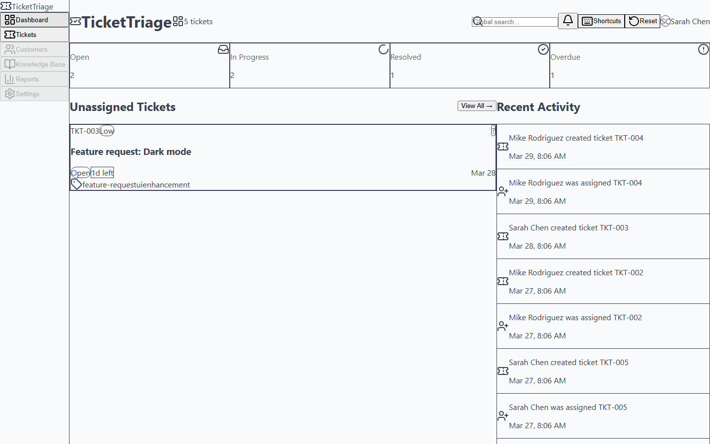
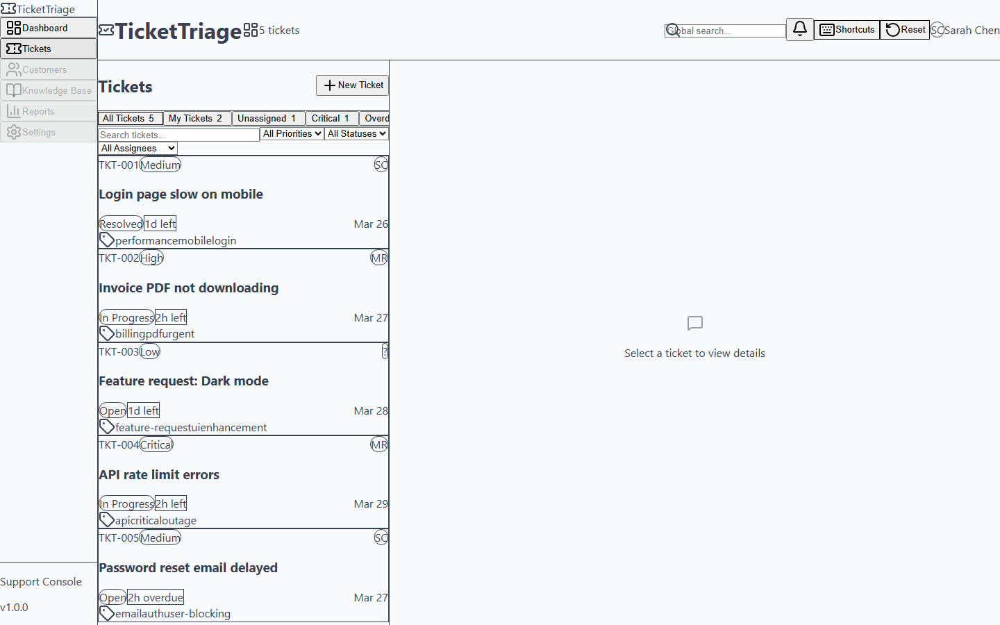
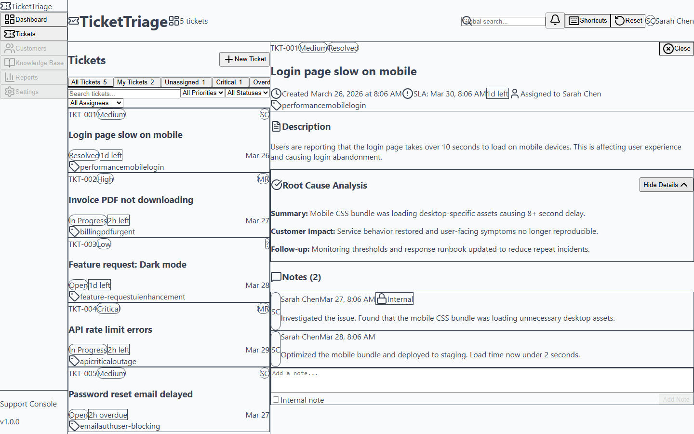

# Smart Ticket Triage Console

Smart Ticket Triage Console is a React helpdesk UI remake built to feel close to a modern internal support desk: dense queue navigation, SLA-aware triage, ticket detail context, and support-first workflows instead of generic CRUD screens.


## What the remake delivers

The current UI focuses on the parts of a support console that matter during live triage:

- a dense ticket queue with quick triage tabs
- a split-panel workflow where queue and detail stay visible together
- SLA visibility, escalation context, and RCA notes where a support rep actually needs them
- dashboard previews that still route back into active ticket work

## Screenshots

Current captures from the live remake are saved under `docs/screenshots/`.

| Dashboard | Queue | Ticket Detail |
|-----------|-------|---------------|
|  |  |  |

## Source inspiration disclosure

This portfolio rebuild is visually and structurally inspired by two open-source helpdesk products:

- **[Peppermint](https://github.com/Peppermint-Lab/peppermint)** — queue density, left-nav app framing, split layout, practical ticket operations
- **[Frappe Helpdesk](https://github.com/frappe/helpdesk)** — service-desk tone, dashboard card summaries, SLA/status visibility, support context in the detail view

This is an original React implementation built for portfolio review. The goal is to study real support product patterns and recreate that workflow in a smaller standalone app. No source code was copied from those projects.

## Support relevance

This repo is meant to show work that maps directly to application support and production triage responsibilities.

| Support workflow | Relevance |
|------------------|-----------|
| Queue rendering | Prioritize open work quickly by ownership, urgency, and overdue state |
| Ticket detail review | Read customer impact, notes, tags, assignee, and SLA context in one place |
| Escalation flow | Move work to a deeper support tier while preserving source-ticket context |
| Resolution + RCA | Capture why the issue happened, not just that it was closed |
| localStorage persistence | Simulates an agent returning to an in-progress queue without losing state |
| Keyboard shortcuts | Reflects the speed-oriented habits common in high-volume support tools |

## Key workflows in the app

- **Queue tabs:** All Tickets, My Tickets, Unassigned, Critical, Overdue
- **Filtering:** search + priority/status/assignee filters
- **Ticket actions:** assign, escalate, resolve, close, add note
- **Detail panel:** note thread, escalation context, RCA reveal, SLA visibility
- **Dashboard preview:** unassigned work and recent activity with quick routing back into tickets

## Run commands

```bash
npm install
npm run dev
npm test
npm run build
npm run preview
```

## Tech stack

| Layer | Technology |
|-------|-----------|
| Framework | React 19 |
| Language | TypeScript 5.9 |
| Build | Vite 8 |
| Styling | Tailwind CSS 4 |
| Testing | Vitest + React Testing Library |
| Persistence | localStorage |

## Testing

`npm test`

Current automated coverage includes:

- queue rendering and triage tab behavior
- dashboard-to-ticket navigation
- ticket detail actions and stored RCA display
- filter behavior
- stats card counts
- ticket state workflow coverage in `useTickets`

## License

MIT
